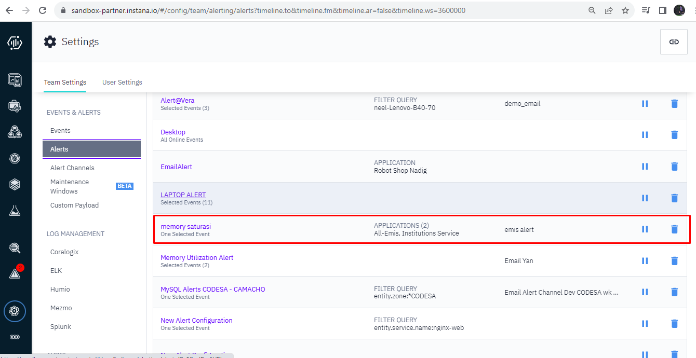

# Create Event and Alert Instana
## Create Event
1. Pilih Setting >> Team Setting >> Event
2. Pilih New Event dan masukkan event yg akan dibuat [gambar 1](asset/event-alert5.png) [gambar 2](asset/event-alert1.png)

## Create Alert
3. Pilih Setting >> Team Setting >> Alert Channels
4. Add alert channel dan pilih Channel 
5. Pilih Setting >> Team Setting >> Alerts 
6. Cek di Chanel yang dipilih [gambar 5](asset/event-alert4.png)
