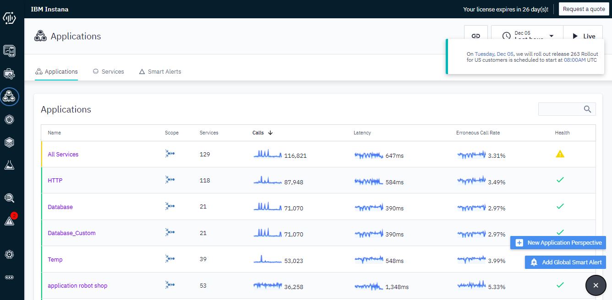
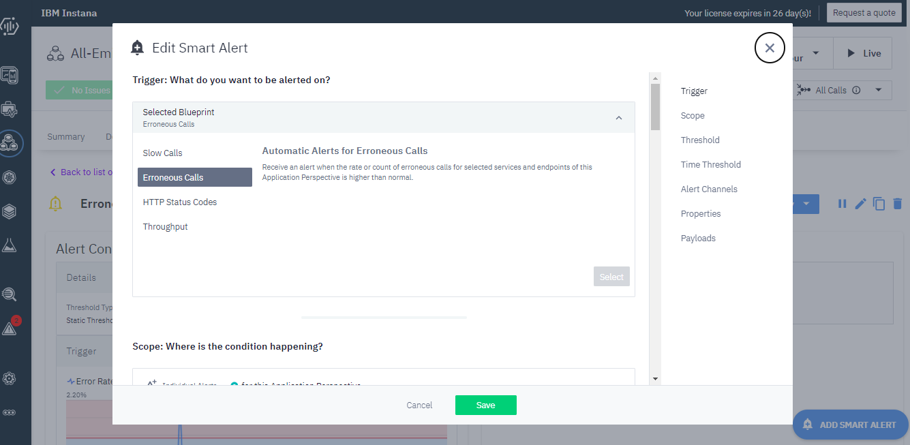
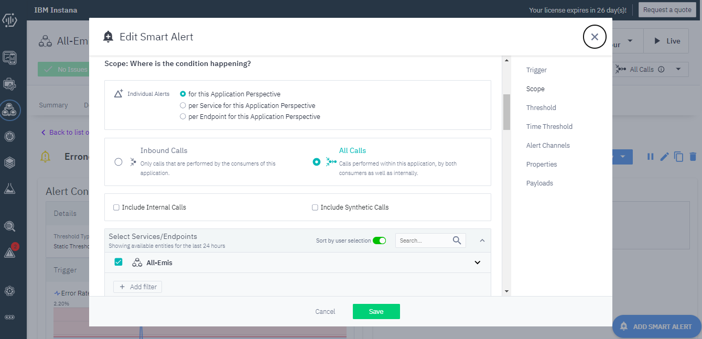
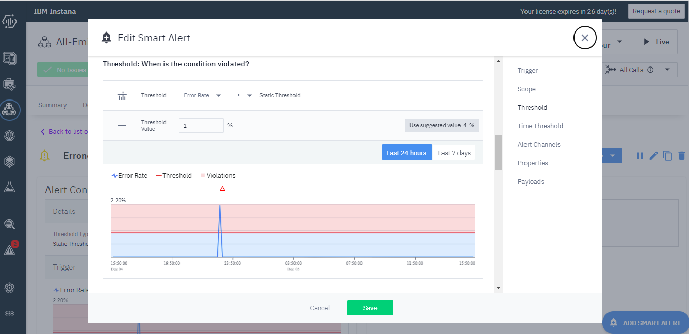
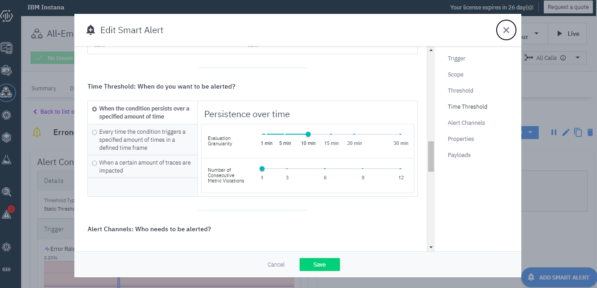
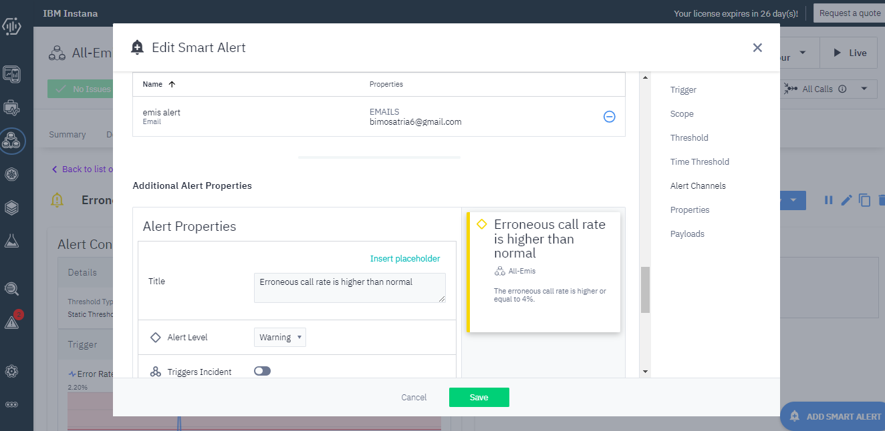

# Create Smart Alert in Aplication Perspective

## Calls
1. Pilih Aplication di menu kiri 
2. Kemudian klik tanda tambah pada kanan bawah dan pilih Add Smart Alert 
3. Lalu pilih pada Blueprint, disini saya memilih erroneus calls 
4. Kemudian pilih for this aplication perspective, all calls dan pilih service aplication perspective yg diinginkan 
5. Isikan ketentuan treshold yg kita inginkan 
6. Setelah itu set timenya 
7. Terakhir isikan Alert Chanel sebagai tujuan pesan pemberitahuan dan Alert Properties untuk membuat deskripsi alert 
8. Terakhir save alert
