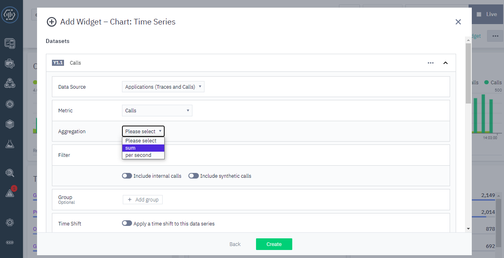
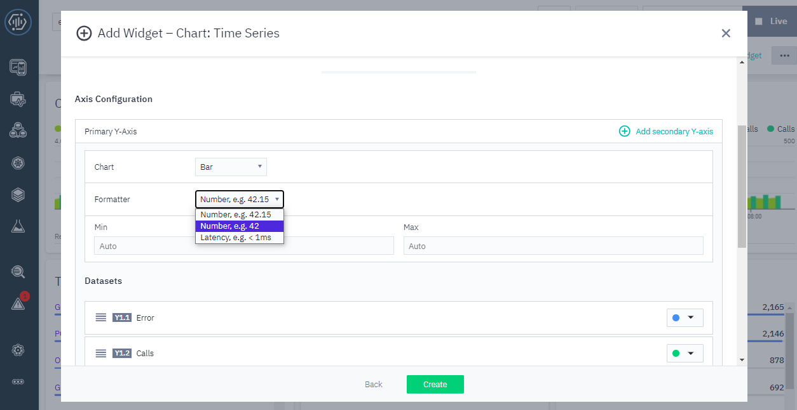

# Create Dashboard Custom Time Series

1. Pilih Instana di menu kiri 
2. Kemudian Create Dashboard 
3. Kemudian Add Widget
4. Setelah itu pilih chart: time series lalu klik next 
5. Pilih Aplication (trace and calls) pada data source 
6. Pilih Calls pada Metrics 
7. Pilih sum pada Aggregation 
8. Kemudian setelah itu masukkan filter zone dan masukkan nama dataset 
9. Add dataset
10. Pilih Aplication (trace and calls) pada data source 
11. Pilih Calls pada Metrics 
12. Pilih sum pada Aggregation 
13. Kemudian setelah itu masukkan filter zone dan filter calls error, lalu masukkan nama dataset 
14. Add dataset
15. Pilih Aplication (trace and calls) pada data source 
16. Pilih latency pada Metrics 
17. Pilih mean pada Aggregation 
18. Kemudian setelah itu masukkan filter zone dan masukkan nama dataset 
19. Setting Primary Y-Axis dengan memilih chart bar dan formatter number  
20. Setting Secondary Y-Axis dengan memilih chart area dan formatter latency
21. Terakhir Isikan nama Widget
