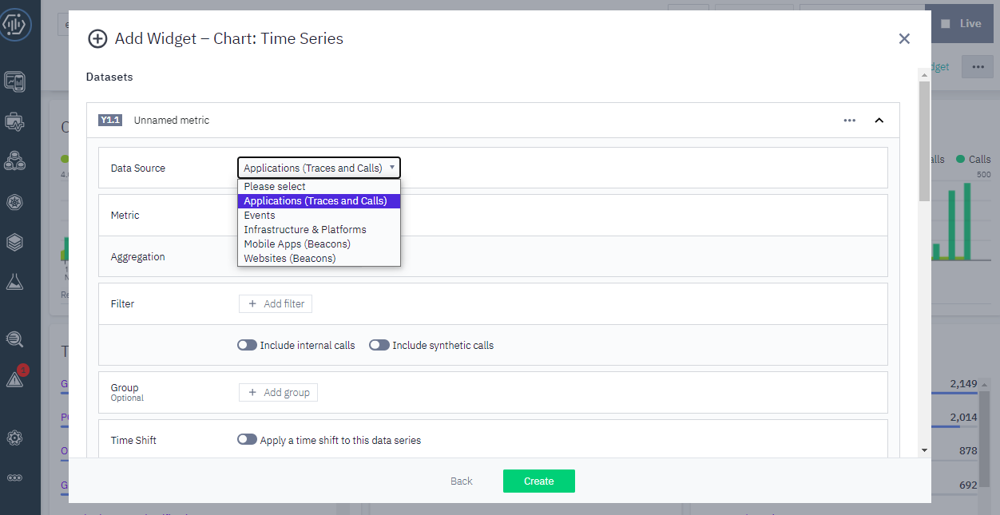
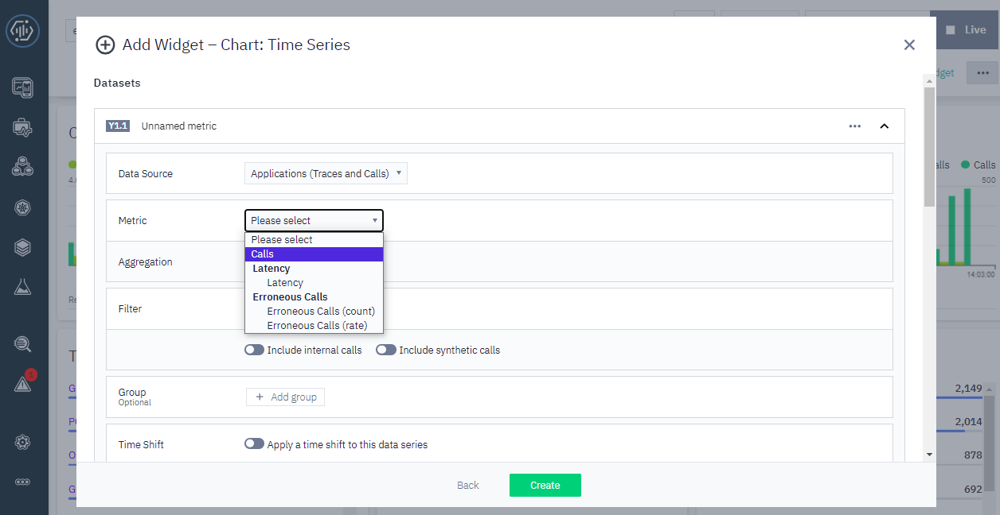
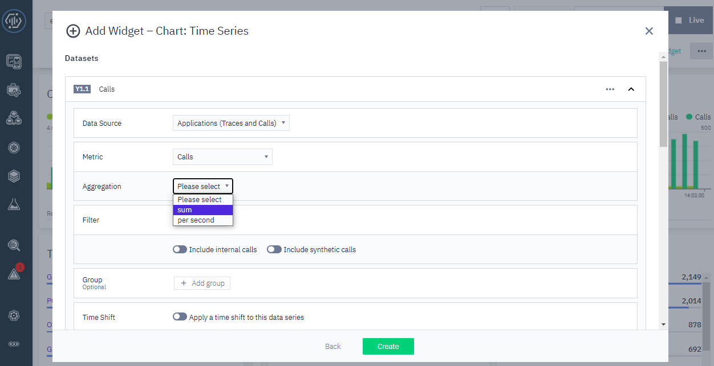
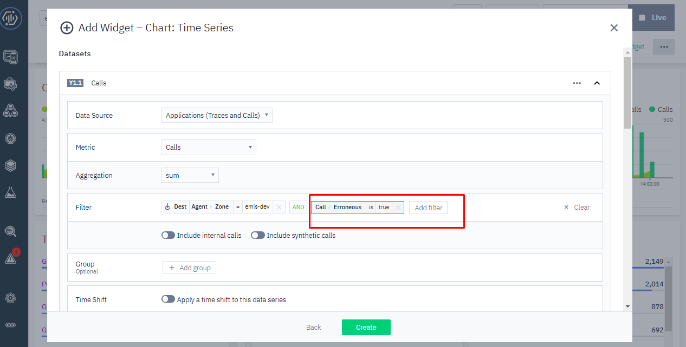

# Create Dashboard Custom Top List Endpoint Error Emis

1. Add Widget
2. Pilih Aplication (trace and calls) pada data source 
3. Pilih Calls pada Metrics 
4. Pilih sum pada Aggregation 
5. Kemudian setelah itu masukkan filter zone dan filter calls error 
6. Lalu Masukkan Group data Endpoint
